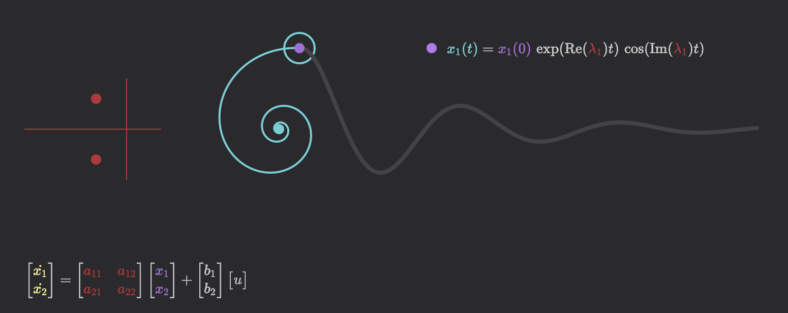

# dynamics-visualizer-p5

a simple, interactive demonstration aimed at helping build intuition for how eigenvalues govern the behavior of dynamical systems. feel free to leave feedback on [the discussions page](https://github.com/awillats/dynamics-visualizer-p5/discussions)

